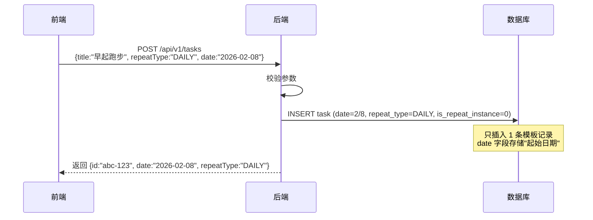
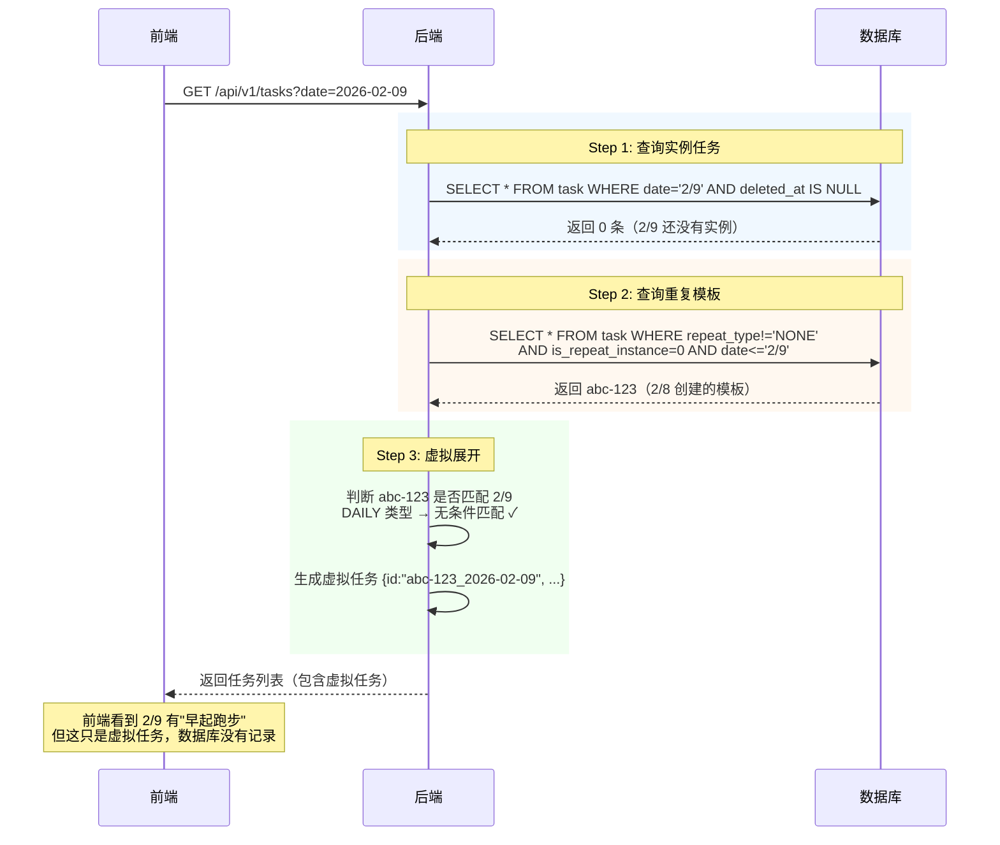
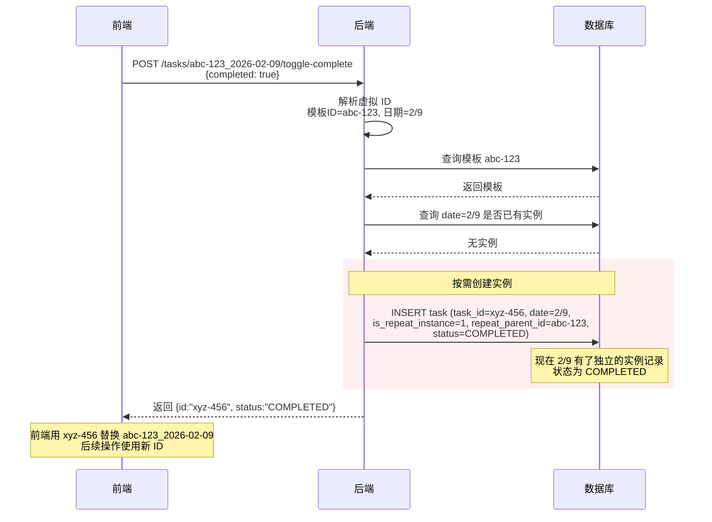
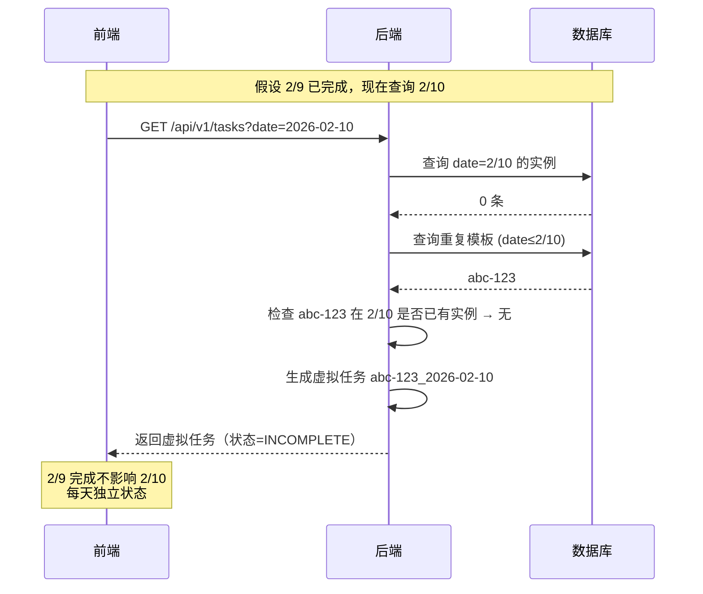

# 重复任务设计方案

## 一、问题与目标

**问题**：用户创建每日重复任务后，往后每一天都应看到该任务，且每天有独立完成状态。若为每天预生成记录，1 个任务 × 1 年 = 365 条，数据量不可接受。

**目标**：数据库只存 1 条模板，查询时动态展开，用户操作时按需实例化。

---

## 二、核心概念

| 概念 | 数据库 | ID 格式 | 说明 |
|------|--------|---------|------|
| **模板任务** | 1 条 | `{uuid}` | 存储重复规则，`date` 为起始日期 |
| **虚拟任务** | 0 条 | `{uuid}_{日期}` | 查询时动态生成，不持久化 |
| **实例任务** | 按需 | `{uuid}` | 用户操作后创建，关联模板 |

---

## 三、关键问题解答

### Q: 2/8 创建的重复任务，2/9 查询时怎么找到它？

**答案**：通过 `date ≤ 查询日期` 条件查找所有"起始日期"在查询日期之前的模板。

```
数据库记录（2/8 创建）：
┌─────────────────────────────────────────────────┐
│ task_id: abc-123                                │
│ date: 2026-02-08    ← 这是"起始日期"，不是归属日期 │
│ repeat_type: DAILY                              │
│ is_repeat_instance: 0                           │
└─────────────────────────────────────────────────┘

2/9 查询时的 SQL：
SELECT * FROM task 
WHERE user_id = ? 
  AND repeat_type != 'NONE'       -- 只查重复模板
  AND is_repeat_instance = 0      -- 排除实例
  AND date <= '2026-02-09'        -- 起始日期 ≤ 查询日期
  AND deleted_at IS NULL

结果：找到 abc-123（因为 2/8 ≤ 2/9）
然后动态生成虚拟任务：abc-123_2026-02-09
```

---

## 四、前后端交互流程

### 4.1 创建重复任务



### 4.2 查询任务列表（虚拟展开核心）



### 4.3 完成重复任务（自动实例化）



### 4.4 再次查询（实例 + 虚拟混合）



---

## 五、数据库设计

### 5.1 task 表关键字段

| 字段 | 模板任务 | 实例任务 | 说明 |
|------|----------|----------|------|
| `date` | 起始日期 | 实例归属日期 | 模板的 date 是创建日期 |
| `repeat_type` | DAILY/WEEKLY/MONTHLY | 继承模板 | |
| `repeat_config` | JSON 配置 | 继承模板 | |
| `repeat_end_date` | 结束日期 | NULL | 可选，限制重复范围 |
| `is_repeat_instance` | 0 | 1 | 区分模板和实例 |
| `repeat_parent_id` | NULL | 模板的 task_id | 实例指向模板 |

### 5.2 查询 SQL 示例

```sql
-- 1. 查询实例任务（包括普通任务）
SELECT * FROM task 
WHERE user_id = ? AND date = '2026-02-09' AND deleted_at IS NULL;

-- 2. 查询重复模板（用于虚拟展开）
SELECT * FROM task 
WHERE user_id = ?
  AND repeat_type != 'NONE'
  AND is_repeat_instance = 0
  AND date <= '2026-02-09'                              -- 起始日期 ≤ 查询日期
  AND (repeat_end_date IS NULL OR repeat_end_date >= '2026-02-09')  -- 未过期
  AND deleted_at IS NULL;
```

### 5.3 重复匹配规则

| 类型 | 配置 | 匹配条件 |
|------|------|----------|
| DAILY | 无 | `queryDate >= startDate`（无条件匹配） |
| WEEKLY | `{"weekdays":[1,3,5]}` | `queryDate.dayOfWeek ∈ weekdays` |
| MONTHLY | `{"dayOfMonth":15}` | `queryDate.day == dayOfMonth` |

---

## 六、透明实例化机制

### 6.1 设计原则

**前端无需感知实例化过程**：所有操作接口（完成、更新、删除）都支持虚拟 ID，后端自动实例化。

```
┌─────────────────────────────────────────────────────────────────┐
│                      前端调用方式                                 │
├─────────────────────────────────────────────────────────────────┤
│  ❌ 错误做法：                                                    │
│     1. 先调用 POST /tasks/{虚拟ID}/materialize                   │
│     2. 再调用 POST /tasks/{实例ID}/toggle-complete               │
│                                                                 │
│  ✅ 正确做法：                                                    │
│     直接调用 POST /tasks/{虚拟ID}/toggle-complete                │
│     （后端自动实例化，返回实例 ID）                                 │
└─────────────────────────────────────────────────────────────────┘
```

### 6.2 接口行为对比

| 接口 | 传入虚拟 ID 时的行为 |
|------|---------------------|
| `toggle-complete` | 自动实例化 → 修改状态 → 返回实例 ID |
| `PUT /tasks/{id}` | 自动实例化 → 更新字段 → 返回实例 ID |
| `DELETE /tasks/{id}` | 自动实例化（标记删除） → 返回成功 |
| `materialize` | 显式实例化 → 返回实例 ID（**很少用**） |

### 6.3 materialize 接口的定位

`POST /api/v1/tasks/{taskId}/materialize` 是**备用接口**，典型场景：

- 前端需要在操作前获取实例 ID（如添加子任务时需要父任务真实 ID）
- 后端内部复用（其他接口的实现可以调用这个方法）

**99% 的情况下，前端不需要调用这个接口。**

---

## 七、接口设计

| 接口 | 虚拟 ID 支持 | 说明 |
|------|-------------|------|
| `POST /api/v1/tasks` | - | 创建任务（重复任务只存 1 条模板） |
| `GET /api/v1/tasks?date=` | - | 查询任务列表（自动展开虚拟任务） |
| `POST /tasks/{taskId}/toggle-complete` | ✅ 自动实例化 | 完成/反完成 |
| `PUT /api/v1/tasks/{taskId}` | ✅ 自动实例化 | 更新任务 |
| `DELETE /api/v1/tasks/{taskId}` | ✅ 自动实例化 | 删除（支持 deleteAll） |
| `POST /tasks/{taskId}/materialize` | ✅ | 显式实例化（备用） |

---

## 八、前端识别规则

```javascript
// 判断是否为虚拟任务（未持久化）
function isVirtualTask(task) {
  return task.isRepeatInstance && task.id.includes('_');
}

// 操作虚拟任务后，用返回的新 ID 替换
async function completeTask(taskId) {
  const result = await api.toggleComplete(taskId, { completed: true });
  if (result.id !== taskId) {
    // 虚拟任务已实例化，更新本地 ID
    updateLocalTaskId(taskId, result.id);
  }
}
```

---

## 九、数据量对比

| 场景 | 预生成方案 | 虚拟展开方案 | 节省 |
|------|-----------|-------------|------|
| 1 个每日任务 × 1 年 | 365 条 | 1 + N | ~90% |
| 10 个每日任务 × 1 年 | 3650 条 | 10 + N | ~90% |

> N = 用户实际操作的天数（完成/编辑/删除）
